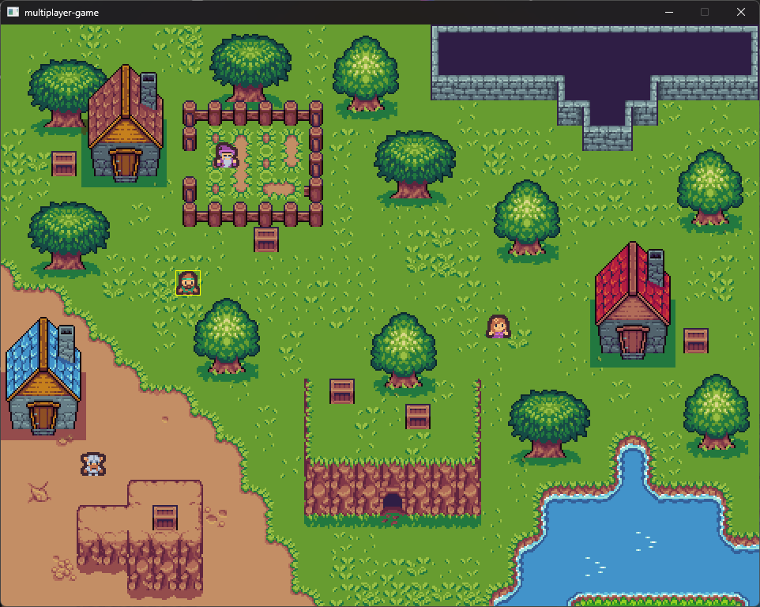

# Let’s Make an Multiplayer Game Without an Engine
*Tomáš Janoušek, Game Access 2025*

---

# Motivation
* University Teacher: *"Do not bother making multiplayer games, **they are too hard**"*
* Colleague: *"I tried making a multiplayer game, but it didn't turned out and I do not want to make **any multiplayer game again**"*

---



---

# About

* Making multiplayer games doesn't have to be hard and can be fun
* We will learn C++20 coroutines and basics of ASIO networking library
* We will learn how to design a simple multiplayer game on real example
* In the end of presentation, I will share the functional code with you so
you can you to start making your very own game right after the presentation

---

# Speaker
* Tomáš Janoušek
* Work Experience: Arma 4, Mafia: The Old Country, TopSpin 2K25
* Networking Experience: Master's thesis
* You don't need any of it

---

# Two-Part Structure
* Networking coding (bottom-up)
* Designing a multiplayer game (top-down)

---

# Coding
*We will connect our application to server. On server, we will listen for new connections.*

---

# Outline
* Tools
* Callbacks
* Coroutines
* Testing

---

# Tools
* VS Code
* C++20
* CMake
* Git

---

# Hello, server!
*First we will show an example, how to connect to a server with ASIO library.*

---

# Connecting to a Server 1/2

```c++
#include <iostream>
#include <asio.hpp>
using asio::ip::tcp;

void connect(tcp::socket& socket, const tcp::resolver::results_type& endpoints);

int main(int argc, char* argv[]) {
  asio::io_context context;  // executes asynchronous tasks
  tcp::socket socket(context);  // connection between computers
  tcp::resolver resolver(context);  // address finder
  auto endpoints = resolver.resolve("127.0.0.1", "8080");
  connect(socket, endpoints); // connect socket to address, next slide
  context.run(); // run all queued tasks
  return 0;
}
```

---

# Connecting to a Server 2/2

```c++
void connect(tcp::socket& socket, const tcp::resolver::results_type& endpoints) {
  asio::async_connect(socket, endpoints, [](std::error_code ec, tcp::endpoint) {
    if (ec) {
      std::cout << "Could not connect: " << ec.message() << "\n";
      return;
    }
    std::cout << "Connected.";
  });
}
```
---

# Introspection
* We connected a client to already running server
* We created an io context to run asynchronous tasks
* We used a callback
* If we would need to send message to server after connection is established,
we would need a callback inside a callback or handle state in some flags.

---
# Coroutines
*Now we are aware of downsides of callbacks, so let's explore another approach.*

---

# Coroutines: What are they?
* Better functions™
* They run and return a value, however, they can be paused (suspended) to wait
* Program can do things in the meantime (draw graphics, handle input, etc.)
* Not specific to networking, but very useful for networking

---

# ASIO Coroutines
* Function signature has return type of `asio::awaitable<Type>`
* Spawned using `asio::co_spawn(executor, awaitable_fn, exception_handler)`
* Suspended using `co_await awaitable_fn` (C++20 keyword)
* Values returned using `co_return` (C++20 keyword)

---


# Wait for Hello world!
```c++
#include <iostream>
#include <asio.hpp>

asio::awaitable<int> greeter(asio::io_context& context) {
    asio::steady_timer timer(context, asio::chrono::seconds(3));
    std::cout << "Wait for it... ";
    co_await timer.async_wait(asio::use_awaitable);
    std::cout << "Hello world!";
    co_return 0;
}

int main() {
    asio::io_context context;
    asio::co_spawn(context, greeter(context), asio::detached);
    context.run();
    return 0;
}
```

<!-- ---
# Coroutines Tips
* Use shared pointers over references, raw pointers
* Use custom completion handler to handle errors
* Use `asio::as_tuple` over `asio::use_awaitable`
* See 'Making Online Multiplayer Games in C++' for more info -->

---

# Client Server Connection
*Once again, we will connect a client to server. Then we will create a server
that will wait for any number of connections.*

---

# Client Connection
```c++
asio::awaitable<void> connect(tcp::socket& socket,
    const tcp::resolver::results_type& endpoints) {
  auto [error_code, _endpoint] =
    co_await asio::async_connect(socket, endpoints, asio::as_tuple);
  if (error_code) {
    std::cout << "Could not connect: " << error_code.message() << "\n";
    co_return;
  }
  std::cout << "Connected!";
}

int main(int argc, char* argv[]) {
  // ...
  co_spawn(context, connect(socket, endpoints), asio::detached);
  // ...
}
```

---
# Server Connection 1/2

```c++
#include <iostream>
#include <asio.hpp>
using asio::ip::tcp;

asio::awaitable<void> listener();

int main(int argc, char* argv[]) {
  asio::io_context context;
  asio::signal_set signals(context, SIGINT /*interrupt*/, SIGTERM /*terminate*/);
  signals.async_wait([&](asio::error_code _ec, int _signal){ context.stop(); });
  co_spawn(context, listener(), asio::detached);
  context.run();
  return 0;
}
```

---
# Server Connection 2/2
```c++
asio::awaitable<void> listener() {
  auto executor = co_await asio::this_coro::executor;
  std::cout << "Staring a server on port 8080...";
  tcp::acceptor acceptor(executor, {tcp::v4(), 8080});
  while (true) {
    auto [ec, socket] = co_await acceptor.async_accept(asio::as_tuple);
    if (ec) {
      std::cout << "Could not accept a new connection: " << ec.message() << "\n";
      co_return;
    }
    std::cout << "There is a new connection!\n";
    // ... use socket variable to send and receive messages
  }
}
```

---

# Test, test, test!
*Before making the fully-fledged game, we need to make sure our basic
functionality is working as intended. We will try that we can connect notebook
to PC. PC will use fixed and wired internet, notebook will use internet from
a mobile hotspot from a different ISP.*

---

# Why we can't run just server...
* Private IP from ISP
* Firewall blocking external packets
* Router not forwarding the port
* Antivirus blocking packets

---

# How to circumfluent internet protections
* Cloud server (AWS, Azure, Google Cloud): 100s€/month
* Custom Server & Public IP: 10€/month + Server Cost
* Virtual Private Network (Hamachi, Zero Tier, RadminVPN): various free plans

---

# Virtual Private Network
* All users need to download the same program.
* One player sets up a new private network.
* Other players then connect to that network.
* Then, all can communicate freely as they are on the same network, meaning one player can run the server and others join it.

---

# Going forward
* Try to send some message from client to server (hint use socket.async_send)
* Try to receive message from client on server (hint use socket.async_receive)
* Try to send message from server to client and receive it

---

# Recap
* We can create a client server connection
* We can use coroutines (think of JS `async`/`await`)
* We can test our program over the real internet
* We still want to make a multiplayer game

---


---

# Designing game
*How to make a new multiplayer game, top-down*

---

# Requirements
* Simple
* Graphical
* 4 players at least
* Reacts to player in realtime

---

# Game
* 2D roleplaying game
* you control one character
* move around the map using keyboard keys
* switch your avatar

---

# Outline
* Graphics
* Serialization
* Network

---

# Graphics outline
* Assets
* Graphics library
* Top-level code

---

# Assets
* AI? No, we are not Call of Duty, we shall use works from actual artists
* Hand-drawn: I'm horrible and slow painter
* Paying someone: I'm poor and making just a prototype
* Free: great for fast prototyping opengameart.org, kenney.org

---

# Graphics library
* GLFW (OpenGL) - possible, but painful
* SFML - older, includes its own networking
* Raylib - simple to use, includes 3D graphics
* SDL3 - industry standard, lightweight

---

# SDL Callbacks Instead of Main
* SDL_AppInit - load all textures
* SDL_AppIterate - draw textures on screen
* SDL_KeyEvent - handle keyboard
* SDL_AppQuit - destroy textures

---

# Network outline
* Networking libraries
* Serialization, deserialization
* Sending and receiving message
* Dependency injection

---

# Network libraries
* Hand-written - possible, but not easily cross platform
* Steam sockets, Yojimbo, GGPO, ... - high-level game networking libraries
* Asio - cross platform, not game related, low level

---

# Serialization
* Process of converting game state/update to a single string
* For client, useful for sending update to server,
* For server, useful for sending server state
* The less characters/bytes we use the better

---

# Client serialization
* On player we serialize only our player info since we can't affect other players
* We will use characters instead of raw bytes for simplicity
* Format: `avatar x_position y_position`
* We can use string streams to convert integers to string

---

# Server serialization
* On server we will send regular updates of all players to client
* We need need to serialize everyone
* Each player should have some unique identifier, avatar and position infos.
* Before sending, we also need to add player's id to let them know who is them
* Format `my_player_id (player_id avatar x_position y_position)+`

---

# Deserialization
* For client, process of converting a single string to a whole game
* For server, converting player's update string

---

# Client deserialization
* Format `my_player_id (player_id avatar x_position y_position)+`
* we can use string streams to read integers from string
* On server, we need to deserialiaze only one player at the time

---

# Sending a message
* socket.async_send(buffer, token)
* buffer - string of characters to send (for us), our serialized string
* token - how is function called, asio::as_tuple

---

# Receiving a message
* socket.async_receive(buffer, token)
* buffer - string where to store obtained chars
* token - how is function called, asio::as_tuple

---

# Decoupling
* Network object would really like to update game state, once we get an update from server it is tempting to move all players in the class itself.
* The problem is then how much functionality should Network do, should it also Draw those objects? It will be god object quite quickly.
* We will rather provide SerializationFn, DeserialiazeFn to the Network object and handle deserialization and serialization elsewhere.
* Doing so, we can focus solely on sending strings to server and receiving them.

---

# Responsibilities
* Main: delegates functionality to individual modules
* Game: contains my player and other players data, handles serialization and deserialization
* Renderer: when given player data, it draws players on screen
* Network: when given serialization functions, will handle network traffic

---

# Server
* headless, i.e., doesn't draw any graphics
* dedicated, run as a separate executable
* autoritative, i.e., says what is the game state and clients must listen
* predictable, i.e, client should be able to predict what server sends them with reasonable accuracy to do local prediction

---

# TCP or UDP?
* reliability: all messages send will reach its destination
* order: if there are two messages send after each other, they will be received after each other
* tcp: reliable, ordered.
* udp: unreliable, not ordered
* you can code abstraction over udp to have reliability and/or order, but not other way round.
* However, we will use tcp to skip coding this abstraction layer

---

# Server update
* It is tempting to move players as soon as we receive their message
* However, we receive messages in random intervals and maybe we receive more updates from one player than the other
* Therefore, we only change player's target destination (where they want to move) when we receive their updates
* Then, in our own update function which is run independantly, we move all players towards their target destination with a constant speed (it will not help you if you spam your target destination more often, you will move there still with the same speed)

---

# Folder structure
```c
project
  |-- client
    |-- main
    |-- game
    |-- network
    |-- renderer
  |-- server
    |-- main
    |-- server
  |-- shared
    |-- player
    |-- players
```
